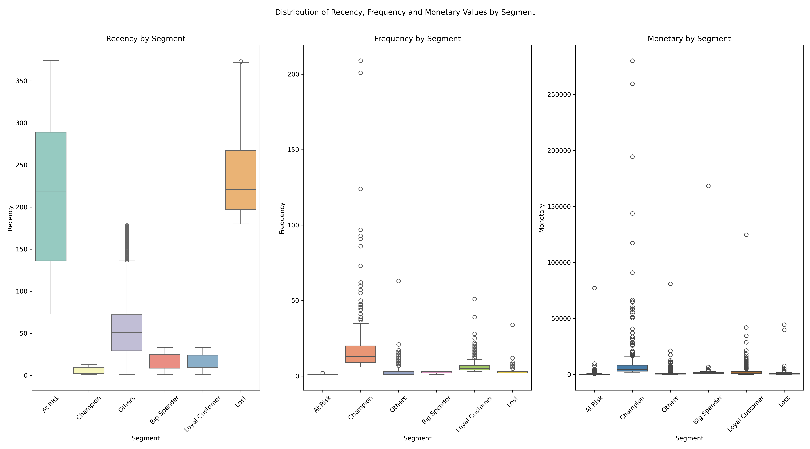
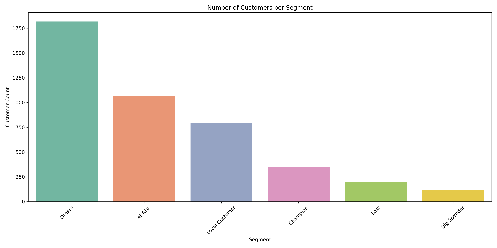
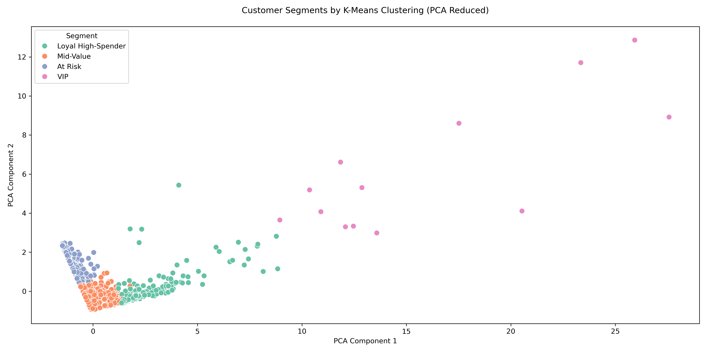

# Customer Segmentation Using RFM Analysis and K-Means Clustering

## Project Overview

This project applies **RFM (Recency, Frequency, Monetary)** analysis and **K-Means Clustering** to segment customers based on their purchasing behavior. Through customer segmentation businesses can:

- Personalize marketing strategies
- Improve customer retention
- Boost profitability

In this project we use historical transaction data to assign each customer to a segment through both **rule-based scoring** and **K-Means clustering**.

---

## Dataset

- **Source**: [UCI Machine Learning Repository - Online Retail Dataset](https://archive.ics.uci.edu/ml/datasets/online+retail)
- **Size**: ~500,000 transactions from a UK-based online retailer (2010–2011)
- **Features**: `InvoiceNo`, `StockCode`, `Description`, `Quantity`, `InvoiceDate`, `UnitPrice`, `CustomerID`, `Country`

---

## Tools & Technologies

- **Python**:
- **Libraries/Packages**:
  - Data manipulation - *`pandas`*, *`numpy`*
  - Data Visualizations - *`matplotlib`*, *`seaborn`*
  - K-Means clustering, scaling, PCA - *`scikit-learn`*

---


## Project Workflow

### 1. Data Cleaning

- Removed rows with missing `CustomerID`
- Filtered out negative/canceled transactions
- Created `TotalPrice` = `Quantity × UnitPrice`

### 2. RFM Feature Engineering

- **Recency**: Days since last purchase
- **Frequency**: Number of invoices per customer
- **Monetary**: Total money spent

### 3. RFM Segmentation

- Used quantile-based scoring (1–5) for each RFM metric
- Created an `RFM_Score` and assigned rule-based segments (e.g., **Champions**, **At Risk**, **Big Spenders**)

### 4. K-Means Clustering

- Scaled RFM values using `StandardScaler`
- Used **Elbow** and **Silhouette** methods to determine `k = 4`
- Applied **K-Means clustering** and labeled clusters based on behavior

### 5. Cluster Analysis

| Cluster | Recency | Frequency | Monetary  | Description                    |
| ------- | ------- | --------- | --------- | ------------------------------ |
| 2       | Low     | Very High | Very High | **VIPs** - top spenders        |
| 3       | Low     | High      | High      | **Loyal High-Spenders**        |
| 0       | Medium  | Medium    | Medium    | **Mid-Value Customers**        |
| 1       | High    | Low       | Low       | **At Risk** - inactive segment |

---

## Visualizations

- **Distribution plots of Recency, Frequency, & Monetary**

- Bar plots showing segment sizes

- 2D scatter plot (via PCA) of clustered customers:

---

## Business Applications

| Strategy           | Description                                   |
| -------------------| --------------------------------------------- |
| Targeted Marketing | Send personalized offers per segment          |
| Loyalty Programs   | Reward top-spending, high-frequency customers |
| Re-engagement      | Win back at-risk or inactive customers        |
| Upsell Strategy    | Focus on mid-value customers to increase CLV  |

---

## Project Structure

```
customer-segmentation-rfm/
│
├── data/                                      # Raw dataset
│   └── rfm_customer_segments.csv
│
├── images/                                    # Visual assets and plots
│   ├── cluster_plot.png
│   ├── customer_segments_chart.png
│   ├── optimal_no_of_clusters_elbow.png
│   ├── optimal_no_of_clusters_silhouette.png
│   └── rfm_distribution_by_segment.png
│
├── output/                                    # Exported datasets
│   └── rfm_segments_with_clusters.csv
│
├── rfm-analysis.ipynb                         # Jupyter notebook for analysis
│
├── README.md                                  # Project documentation
│
└── .gitignore                                 # Files excluded from version control
```
---